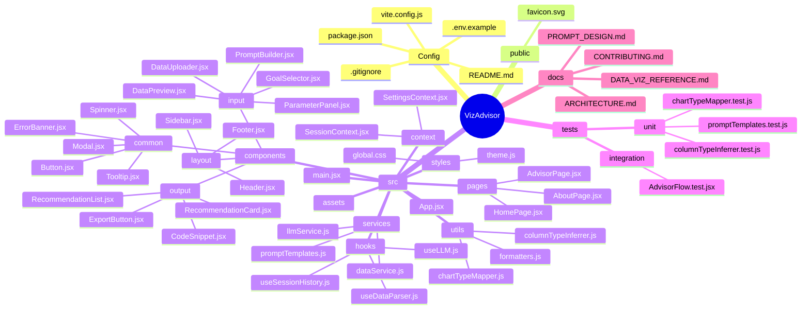

```mermaid
mindmap
  root((VizAdvisor))
    Config
      README.md
      .env.example
      .gitignore
      package.json
      vite.config.js
    public
      favicon.svg
    src
      main.jsx
      App.jsx
      assets
      components
        layout
          Header.jsx
          Footer.jsx
          Sidebar.jsx
        input
          DataUploader.jsx
          DataPreview.jsx
          GoalSelector.jsx
          ParameterPanel.jsx
          PromptBuilder.jsx
        output
          RecommendationCard.jsx
          RecommendationList.jsx
          CodeSnippet.jsx
          ExportButton.jsx
        common
          Button.jsx
          Spinner.jsx
          Modal.jsx
          Tooltip.jsx
          ErrorBanner.jsx
      pages
        HomePage.jsx
        AdvisorPage.jsx
        AboutPage.jsx
      hooks
        useLLM.js
        useDataParser.js
        useSessionHistory.js
      services
        llmService.js
        dataService.js
        promptTemplates.js
      context
        SessionContext.jsx
        SettingsContext.jsx
      utils
        columnTypeInferrer.js
        chartTypeMapper.js
        formatters.js
      styles
        global.css
        theme.js
    tests
      unit
        columnTypeInferrer.test.js
        chartTypeMapper.test.js
        promptTemplates.test.js
      integration
        AdvisorFlow.test.jsx
    docs
      ARCHITECTURE.md
      PROMPT_DESIGN.md
      DATA_VIZ_REFERENCE.md
      CONTRIBUTING.md
```
