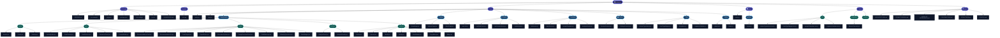

# VizAdvisor — Repository Map (Mermaid)

> Renders as a flowchart in Mermaid-compatible viewers. Last updated: February 2026

```mermaid
flowchart TD
    ROOT([🗂️ VizAdvisor]):::root

    ROOT --> CFG([⚙️ Config]):::tier1
    ROOT --> PUB([🌐 public/]):::tier1
    ROOT --> SRC([⚛️ src/]):::tier1
    ROOT --> SVR([🖥️ server/]):::tier1
    ROOT --> TST([🧪 tests/]):::tier1
    ROOT --> DOC([📚 docs/]):::tier1

    %% ── Config ──────────────────────────────────────────────
    CFG --> C1[README.md]:::file
    CFG --> C2[.env.example]:::file
    CFG --> C3[.gitignore]:::file
    CFG --> C4[package.json]:::file
    CFG --> C5[vite.config.js]:::file
    CFG --> C6[run.sh]:::file
    CFG --> C7[CHANGELOG.md]:::file

    %% ── Public ──────────────────────────────────────────────
    PUB --> P1[vite.svg]:::file

    %% ── src ─────────────────────────────────────────────────
    SRC --> S1[main.jsx]:::file
    SRC --> S2[App.jsx]:::file
    SRC --> COMP([🧩 components/]):::tier2
    SRC --> PAGES([📄 pages/]):::tier2
    SRC --> HOOKS([🪝 hooks/]):::tier2
    SRC --> SERV([🔌 services/]):::tier2
    SRC --> CTX([🗃️ context/]):::tier2
    SRC --> UTIL([🔧 utils/]):::tier2
    SRC --> STY([🎨 styles/]):::tier2

    %% ── components ──────────────────────────────────────────
    COMP --> LAY([layout/]):::tier3
    COMP --> INP([input/]):::tier3
    COMP --> OUT([output/]):::tier3
    COMP --> ANL([analysis/]):::tier3
    COMP --> CMN([common/]):::tier3

    LAY --> L1[Header.jsx]:::file
    LAY --> L2[Footer.jsx]:::file
    LAY --> L3[Sidebar.jsx]:::file

    INP --> I1[DataUploader.jsx]:::file
    INP --> I2[DataPreview.jsx]:::file
    INP --> I3[GoalSelector.jsx]:::file
    INP --> I4[ParameterPanel.jsx]:::file
    INP --> I5[PromptBuilder.jsx]:::file

    OUT --> O1[RecommendationCard.jsx]:::file
    OUT --> O2[RecommendationList.jsx]:::file
    OUT --> O3[CodeSnippet.jsx]:::file
    OUT --> O4[ExportButton.jsx]:::file
    OUT --> O5[AlternativeOptions.jsx]:::file
    OUT --> O6[DesignDecisionsPanel.jsx]:::file
    OUT --> O7[PitfallWarnings.jsx]:::file
    OUT --> O8[FollowUpQuestions.jsx]:::file
    OUT --> O9[MetaBadges.jsx]:::file

    ANL --> A1[AnalysisPanel.jsx]:::file
    ANL --> A2[AnalysisResults.jsx]:::file

    CMN --> CM1[Button.jsx]:::file
    CMN --> CM2[Spinner.jsx]:::file
    CMN --> CM3[Modal.jsx]:::file
    CMN --> CM4[Tooltip.jsx]:::file
    CMN --> CM5[ErrorBanner.jsx]:::file
    CMN --> CM6[CopyButton.jsx]:::file
    CMN --> CM7[Badge.jsx]:::file

    %% ── pages ───────────────────────────────────────────────
    PAGES --> PG1[HomePage.jsx]:::file
    PAGES --> PG2[AdvisorPage.jsx]:::file
    PAGES --> PG3[AboutPage.jsx]:::file

    %% ── hooks ───────────────────────────────────────────────
    HOOKS --> H1[useLLM.js]:::file
    HOOKS --> H2[useDataParser.js]:::file
    HOOKS --> H3[useSessionHistory.js]:::file
    HOOKS --> H4[useAnalysis.js]:::file

    %% ── services ────────────────────────────────────────────
    SERV --> SV1[llmService.js]:::file
    SERV --> SV2[dataService.js]:::file
    SERV --> SV3[promptTemplates.js]:::file
    SERV --> SV4[analysisService.js]:::file

    %% ── context ─────────────────────────────────────────────
    CTX --> CX1[SessionContext.jsx]:::file
    CTX --> CX2[SettingsContext.jsx]:::file

    %% ── utils ───────────────────────────────────────────────
    UTIL --> U1[columnTypeInferrer.js]:::file
    UTIL --> U2[chartTypeMapper.js]:::file
    UTIL --> U3[formatters.js]:::file
    UTIL --> U4[responseValidator.js]:::file

    %% ── styles ──────────────────────────────────────────────
    STY --> ST1[global.css]:::file
    STY --> ST2[theme.js]:::file

    %% ── server ───────────────────────────────────────────────
    SVR --> SVRI[index.js]:::file
    SVR --> SVRAN([analysis/]):::tier2
    SVRAN --> SVRRUN[runner.js]:::file

    %% ── tests ───────────────────────────────────────────────
    TST --> UNIT([unit/]):::tier3
    TST --> INTG([integration/]):::tier3
    TST --> PROMPTS([prompts/]):::tier3

    UNIT --> TU1[columnTypeInferrer.test.js]:::file
    UNIT --> TU2[chartTypeMapper.test.js]:::file
    UNIT --> TU3[promptTemplates.test.js]:::file
    UNIT --> TU4[responseValidator.test.js]:::file

    INTG --> TI1[AdvisorFlow.test.jsx]:::file

    %% ── docs ────────────────────────────────────────────────
    DOC --> D1[ARCHITECTURE.md]:::file
    DOC --> D2[PROMPT-DESIGN.md]:::file
    DOC --> D3[DATA-VIZ-REFERENCE.md]:::file
    DOC --> D4[CONTRIBUTING.md]:::file
    DOC --> D5[STRUCTURE.md]:::file
    DOC --> D6[ROUTES.md]:::file

    %% ── Class Definitions ───────────────────────────────────
    classDef root   fill:#1e1b4b,color:#e0e7ff,stroke:#6366f1,stroke-width:3px
    classDef tier1  fill:#312e81,color:#c7d2fe,stroke:#818cf8,stroke-width:2px
    classDef tier2  fill:#1e3a5f,color:#bae6fd,stroke:#38bdf8,stroke-width:1.5px
    classDef tier3  fill:#134e4a,color:#99f6e4,stroke:#2dd4bf,stroke-width:1px
    classDef file   fill:#0f172a,color:#94a3b8,stroke:#1e293b,stroke-width:1px
```
